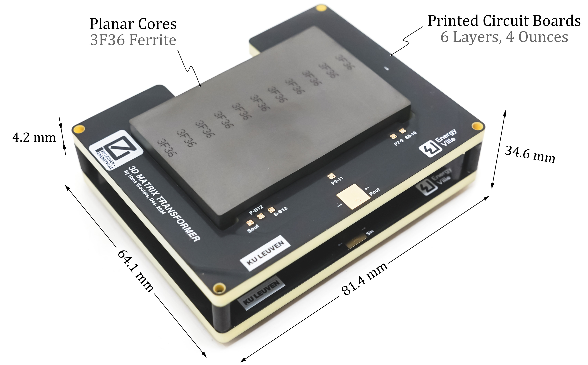

# 3D-Matrix Inductor Transformer (3D-MIT)
[](https://opensource.org/licenses/MIT)




MATLAB implementation for the 3D-Matrix Inductor Transformer published in IEEE Journal of Emerging and Selected Topics in Power Electronics. This repository provides all analytical models, derivations, datasets, design steps, and visualisations for the 3D-MIT.

## License
MIT Licensed - See [LICENSE](LICENSE)

## Citation
H. Wouters, W. Vanderwegen, C. Keibeck, M. Ryłko, K. Umetani and W. Martinez, "3D-Matrix Inductor-Transformer with Fractional-Turn Interleaving in a CLLC Resonant Converter for Bidirectional Onboard Chargers," in IEEE Journal of Emerging and Selected Topics in Power Electronics, doi: 10.1109/JESTPE.2025.3587336.
  
## Contents
- 3D-MIT flux and inductance model derivation, validation, and visualisation
- CLLC converter resonant tank design
- Parametric optimisation based on analytical and Ansys Maxwell results
- Data and visualisation of various experiments related to the 3D-MIT and the CLLC converter

## 🔓 Read the Paper
- On [ResearchGate](https://www.researchgate.net/publication/393497465) (Open Access pre-print)
- On [IEEE Xplore](https://ieeexplore.ieee.org/document/11075679) (Early Access)

## Repository Structure
- `/data`: All measurement and simulation datasets
- `/code/*.m files`: Analysis scripts ordered by paper sequence
  - [`MIT_v0_DowellEquationModel.m`](MIT_v0_DowellEquationModel.m) Dowell Equation Winding Loss Modelling
  - [`MIT_v1a_InductanceModelDerivation.m`](MIT_v1a_InductanceModelDerivation.m) Derivation of 3D-MIT Inductance Matrix
  - [`MIT_v1b_InductanceModelValidation.m`](MIT_v1b_InductanceModelValidation.m) Validation of Inductance Model
  - [`MIT_v1c_FluxWaveformsExample.m`](MIT_v1c_FluxWaveformsExample.m) Example flux waveforms in the 3D-MIT
  - [`MIT_v2a_ConverterFHA.m`](MIT_v2a_ConverterFHA.m) First harmonic aproximation of the CLLC converter
  - [`MIT_v2b_InductancesOverview.m`](MIT_v2b_InductancesOverview.m) Example overview of inductances design space
  - [`MIT_v2c_InductanceDesignCLLC.m`](MIT_v2c_InductanceDesignCLLC.m) Inductances design space for the CLLC converter
  - [`MIT_v3a_ParametricOptimisationMatlab.m`](MIT_v3a_ParametricOptimisationMatlab.m) Parametric 3D-MIT design with commercial cores
  - [`MIT_v3b_ParametricOptimisationAnsys.m`](MIT_v3b_ParametricOptimisationAnsys.m) Plot Ansys parametric 3D-MIT design with custom cores
  - [`MIT_v4a_ExperimentImpedances.m`](MIT_v4a_ExperimentImpedances.m) Experimental results of 3D-MIT impedance
  - [`MIT_v4b_ExperimentConverterWaveforms.m`](MIT_v4b_ExperimentConverterWaveforms.m) Experimental results of converter waveforms
  - [`MIT_v4c_ExperimentThermalProfile.m`](MIT_v4c_ExperimentThermalProfile.m) Experimental results of transient thermal behaviour
  - [`MIT_v4d_ExperimentConverterEfficiency.m`](MIT_v4d_ExperimentConverterEfficiency.m) Experimental results of converter efficiency
- `run_all.m`: Master script to run all analyses sequentially
- `run.sh`: Code Ocean executable script (for capsule)
- `LICENSE`: MIT License terms

## Requirements
- MATLAB 2024a
- Global Optimization Toolbox (required for parametric optimisation)

## Contributors
- **Wout Vanderwegen**  
  https://github.com/woutVDW  
  CLLC converter design and testing
  
## Usage

### Individual Script Execution
1. Clone repository
2. Run any `.m` file in MATLAB 2024a
   - Files follow paper's sequence
   - Executable independently

### Full Reproducible Run
```bash
# Run all analyses sequentially
matlab -batch "run_all"
